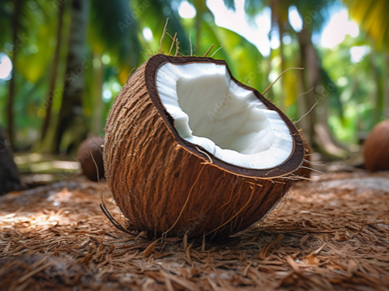

# Pixel Interpolation

## Overwiev

Pixel interpolation is the process of smoothly transitioning the colors of corresponding pixels between two images over a set number of steps, creating a gradual visual transformation from one image to another.

## Screenshots

 

|   |  |  |  |  |
|-----------------------------------|------------------------------------|------------------------------------|------------------------------------|--------------------------------------|
|   |  |  |  |  |
|   |  |  |  |  |
|   |  |  |  |  |