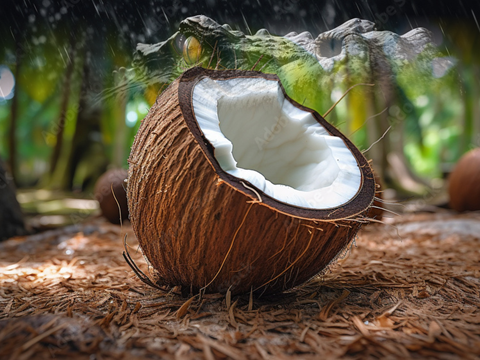

# Pixel Interpolation

## Overview

Pixel interpolation is the process of smoothly transitioning the colors of corresponding pixels between two images over a set number of steps, creating a gradual visual transformation from one image to another.
The application supports two types of interpolation: Standard and Directional interpolation.

## Requirements and Setup

The program is built using the JavaFX framework, which requires proper configuration of the JavaFX libraries. The following dependencies are necessary to run the project:

- `javafx-controls`

- `javafx-fxml`

To start the application, run the `PixelInterpolation.java` file located in the `com.example.pixelinterpolation` package.

## How It Works

The pixel interpolation process occurs in the following steps:

__Loading Image Data:__ The application loads the first and second images and retrieves their pixel data. Each pixel's color is stored in RGB (red, green, blue) format.

__Accessing Pixels:__ The program iterates through the pixels of the images. For each pixel, it associates the RGB values of the corresponding pixels from both images.

__Calculating Intermediate Color Values:__ For each pixel, the program calculates the intermediate RGB values using the following formula:

`Interpolated color = Starting color + (Target color − Starting color) / Number of steps x Current step`

Using this formula, each pixel's color gradually approaches the color of the corresponding pixel in the second image.

__Updating the Image:__ After the program calculates the new RGB values, it updates the image to display the current interpolated state.

__Final Image Display:__ At the end of the interpolation, the pixel colors reach those of the second image, allowing the user to see a smooth and gradual transformation from the first image to the second.

## Standard Inetrpolation

Standard interpolation provides a complete transformation between the two images, where all pixels change simultaneously.

__Number of Steps__

The user can determine how many steps the transformation should consist of. 
The number of steps affects the smoothness and continuity of the transition: the more steps set, the finer the color gradient will be.

__Delay__

The user can also set a delay between the steps, allowing them to observe the transition for a longer period. 
The length of the delay determines how quickly the animation proceeds.

## Directional Interpolation

In directional interpolation, the user can set the direction in which the transformation occurs. 
This feature allows for a more dynamic visual experience as different parts of the image can change in various directions.

__Direction__

The user can choose from four different directions for the transformation:

- Left to Right
- Right to Left
- Top to Bottom
- Bottom to Top

__Interpolation Band__

During directional interpolation, the user can set the width of the transformation band. 
This band defines the area within which the entire transformation takes place.

## Pause and Resume

The interpolation process can be paused and resumed using the controls available on the user interface. 
The Pause option allows the user to stop the interpolation at any time during the process, and the Resume option lets them continue from where they left off. 
This feature is particularly useful if the user wants to observe specific phases of the transformation more closely.

## Reset

The user can reset the interface to its original starting state at any time. 
This reset function allows them to interrupt the process and restart the interpolation without having to reload the original images.

## Screenshots

 

|   |  |  |  |  |
|-----------------------------------|------------------------------------|------------------------------------|------------------------------------|--------------------------------------|
|   |  |  |  |  |
|   |  |  |  |  |
|   |  |  |  |  |

 

 

|  |  |  |  |  |
|----------------------------------|--------------------------------------|--------------------------------------|--------------------------------------|--------------------------------------|
|  |  |  |  |  |
|  |  |  |  |  |
|  |  |  |  |  |
